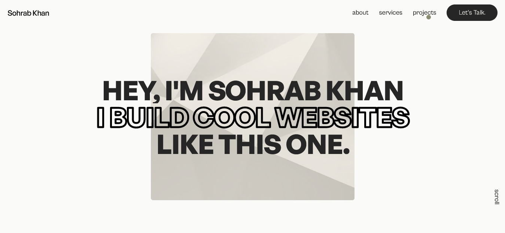

# Portfolio

This is my portfolio website created with Next.js and GSAP.

## Description

This portfolio showcases my projects and skills. It is built using Next.js, a React framework, and GSAP for animations.

## Screenshot

## Features

- Responsive design
- Smooth animations using GSAP
- Project showcase with images and descriptions
- Links to live projects and GitHub repositories

## Technologies Used

- Next.js
- GSAP
- HTML
- Tailwind CSS

## Installation

1. Clone the repository: `https://github.com/Iamsohrabkhan/Personal_Website.git`
2. Install dependencies: `pnpm install`

## Usage

1. Run the development server: `pnpm run dev`
2. Open your browser and visit `http://localhost:3000`

## Screenshots
src/app/opengraph-image.png

## License

This project is licensed under the [MIT License](LICENSE).

## Contact

- Portfolio: https://sohrabkhan.vercel.app/
- LinkedIn: https://www.linkedin.com/in/iamsohrabkhan/
- Email: 7ohrabkhan@gmail.com

